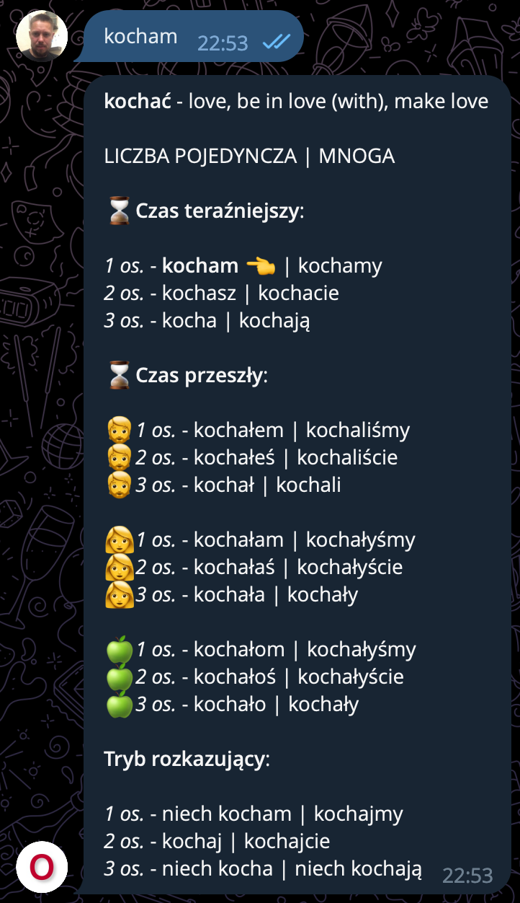

[](https://github.com/jazzman/odmiana/actions/workflows/cicd.yml)

# Odmiana Telegram Bot

Odmiana is an easy-to-use Telegram bot for those who are learning Polish.

It will save you from having to constantly go to different sites to find the right case or conjugation of a word. Simply send it a word and it will return all its forms.
Currently, the bot only supports verbs, but I plan to add support for other parts of speech in the near future. And later, grammar cheatsheets, and possibly practical exercises to learn this beautiful language.

For example, if you send the word: "kocham", you will receive the following:

<p align="center">
    
</p>

## Running Locally

### Pre-requisites

Make sure you have installed:
- JDK 17
- Gradle
- Docker and Docker Compose

### Setup

1. Ask @BotFather to create a bot for you
2. Save the token for accessing to Telegram HTTP API
3. Clone the project
4. Set the following environment variables:

| Environment Variable | Description                           | Default   | Example                                        |
|:--------------------:|---------------------------------------|-----------|------------------------------------------------|
| TELEGRAM_USERNAME    | Username as you told it to @BotFather | N/A       | odmiana_test_753_bot                           |
| TELEGRAM_TOKEN       | Token @BotFather sent to you          | N/A       | 1234567890:AAAAAAA-TMIrr1PZPowv3hNdHkn2eEMnjq8 |
| MONGO_HOST           | MongoDB hostname                      | localhost | localhost                                      |
| MONGO_PORT           | MongoDB port to expose                | 27017     | 27017                                          |
| MONGO_USERNAME       | MongoDB root username                 | root      | root                                           |
| MONGO_PASSWORD       | MongoDB root password                 | secret    | secret                                         |
| MONGO_DATABASE       | MongoDB database name                 | odmiana   | odmiana                                        |

5. Go to the `infrastructure` and run start the MongoDB container:

```shell
cd infrastructure
docker compose up
```

6. Run an application:

```shell
cd ..
./gradlew bootRun
```

7. Open Telegram, find your bot and start a chat. Enjoy.

## Contributing

Pull requests are welcome. For major changes, please open an issue first
to discuss what you would like to change.

Please make sure to update tests as appropriate.
